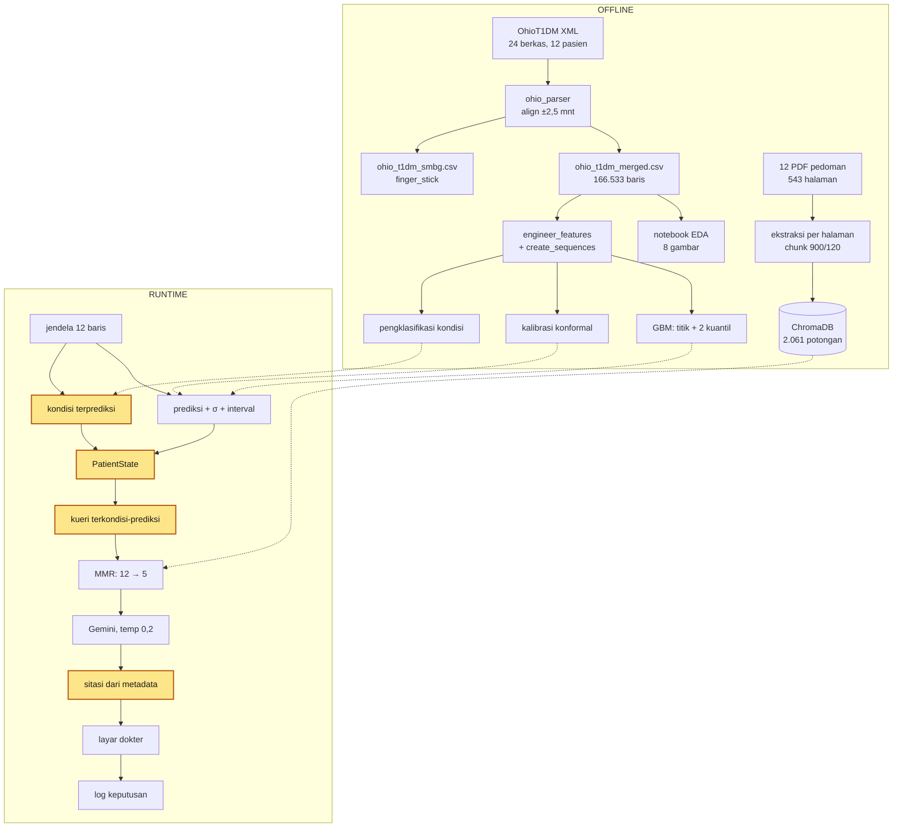

# Alur Sistem — Spesifikasi Beku

> **Ditetapkan 14 Agustus 2026.** Cabang `refaktor-tujuh-tugas`.
>
> Dokumen ini adalah **rujukan tunggal** atas rancangan sistem. Ia menyatakan apa yang
> sistem ini kerjakan, mengapa demikian, dan **apa yang tidak boleh berubah tanpa
> konsultasi lebih dulu**.
>
> Hubungan dengan dokumen lain:
> - `docs/METHODOLOGY.md` — uraian panjang tiap tahap beserta justifikasinya
> - `docs/KEPUTUSAN_DIAMBIL.md` — delapan keputusan pembimbing (11–13 Agustus)
> - `docs/DAFTAR_KETERBATASAN.md` — K1–K15
> - **Dokumen ini** — ringkasan mengikat: alur, invarian, dan batas
>
> Bila terjadi pertentangan antara dokumen ini dan kode, **kode yang benar dan dokumen
> ini yang salah** — laporkan agar diperbaiki, jangan diam-diam disesuaikan.

---

## 1. Apa sistem ini

**Sistem pendukung keputusan klinis (CDSS) untuk diabetes melitus tipe 1**, yang
menelusuri pedoman klinis berdasarkan **kondisi yang diprediksi akan terjadi**, bukan
kondisi yang sedang berlaku.

| | |
|---|---|
| Kontribusi | *query transformation* terkondisi-prediksi |
| Jangkar metodologis | Kresevic dkk. (2024) — RAG atas pedoman klinis untuk CDSS |
| Metodologi penelitian | Peffers dkk. (2007) — DSRM |
| Kerangka konseptual | Sutton dkk. (2020) — definisi CDSS |
| Sifat | *proof-of-concept*, tanpa uji klinis |

### Apa yang sistem ini BUKAN

Dinyatakan eksplisit agar tidak melar:

- **Bukan** *digital twin*. Istilah itu dihapus dari seluruh naskah.
- **Bukan** mesin simulasi *what-if*. Klaimnya sudah dicabut dari README dan aplikasi.
- **Bukan** pengganti keputusan dokter. Alur *doctor-mediated*, dokter penentu akhir.
- **Bukan** sistem yang meramal lebih dari 60 menit. Lihat §6.
- **Bukan** antarmuka tanya-jawab bebas. Kueri berasal dari prediktor, bukan dari
  pertanyaan pengguna. Lihat §6.

---

## 2. Dua lingkar keputusan — dasar seluruh rancangan

Pengelolaan DMT1 punya dua lingkar yang berbeda skala waktu. Sistem ini melayani
**lingkar pertama**, dan divalidasi pada **lingkar kedua**.

| | Lingkar harian | Lingkar kontrol |
|---|---|---|
| Pengambil keputusan | **penderita**, beberapa kali sehari | **dokter**, saat kunjungan |
| Yang diputuskan | bolus koreksi, karbohidrat, aktivitas | regimen: rasio insulin |
| Dasarnya | glukosa terkini + rencana | pola **beberapa hari berturutan** |
| Sumber | KB-01 hal. 23 — *"bolus yang diaktifkan oleh penderita"* | KB-01 hal. 18 |
| **Horizon sistem** | **30 dan 60 menit** ✅ | tidak dilayani |

**Peran alur *doctor-mediated*:** dokter memvalidasi rekomendasi pada kunjungan kontrol,
di atas logbook yang dibawa pasien — mekanisme yang sudah baku menurut KB-02 hal. 8.
Rekomendasi tervalidasi itu menjadi acuan penderita sampai kunjungan berikutnya.

**Nilai tambah terkonsentrasi pada kasus divergen** — 13,2% jendela ketika kondisi
terkini berbeda kategori dari kondisi 30 menit kemudian. Pada kasus itu, satu pembacaan
tunggal menyesatkan.

---

## 3. Alur lengkap — 14 tahap

### 3.1 Peta



Kotak kuning = tahap yang menjadi kontribusi metodologis.

### 3.2 Kontrak antar-tahap

| # | Tahap | Masukan | Keluaran | Berkas |
|---|---|---|---|---|
| 1 | Parse | 24 XML | 2 CSV (CGM + finger_stick) | `src/data/ohio_parser.py` |
| 2 | EDA | CSV | 8 gambar; **3 keputusan rancangan** (stres dikeluarkan, IOB/COB, segmentasi jeda) | `notebooks/01_data_exploration.ipynb` |
| 3 | Praproses | CSV | interpolasi ≤6 langkah, sisanya dibuang | `preprocessor.handle_missing_values` |
| 4 | Rekayasa fitur | tabel | +`iob`, `cob`, `glucose_delta`, `hour_sin`, `hour_cos` | `preprocessor.engineer_features` |
| 5 | Jendela | tabel berfitur | `X`(n,12,7), `y`, `anchor`; jendela berjeda >30 mnt **dibuang** | `preprocessor.create_sequences` |
| 6 | Pelatihan | `X`, `y−anchor` | bundle: model titik + 2 kuantil + scaler | `src/models/gbm_model.py` |
| 7 | Kalibrasi | model 8-pasien + 2 pasien kalibrasi | `conformal_h{6,12}.json` | `scripts/conformal_calibration.py` |
| 8 | Pengklasifikasi | fitur sama | 3 kelas kondisi | `scripts/train_condition_classifier.py` |
| 9 | Korpus | 12 PDF + manifest | 2.061 potongan + `halaman_cetak` | `scripts/reingest_kb.py` |
| 10 | Prediksi *runtime* | 12 baris terakhir | `pred`, `σ`, `(lo,hi)` | `app/streamlit_app.py` |
| 11 | **Perakitan state** | pred + interval + kondisi | `PatientState` — risiko dari **nilai TERPREDIKSI** | `src/patient_state.py` |
| 12 | **Transformasi kueri** | `PatientState` | `primary_query` + `llm_context` | `_primary_query` |
| 13 | Penelusuran + generasi | kueri | 5 potongan → teks ber-`[S1..Sn]` **tanpa nomor halaman** | `retriever.py`, `prompts.py` |
| 14 | Sitasi + keluaran | metadata | `page_label`, layar dokter, log keputusan | `citations.py`, `decision_log.py` |

### 3.3 Fitur rekayasa — apa dan untuk apa

| Fitur | Rumus | Untuk apa |
|---|---|---|
| `iob` | τ=240 mnt, `decay`=0,9794 | insulin **yang masih aktif**; nilai mentah nol di luar kejadian |
| `cob` | τ=180 mnt, `decay`=0,9726 | karbohidrat **belum terserap** |
| `glucose_delta` | `diff(3)` = 15 menit | arah gerak, bukan hanya posisi |
| `hour_sin`, `hour_cos` | siklis 24 jam | pola diurnal; 23.00 dan 01.00 berdekatan di ruang fitur |
| `glucose` | mentah | **wajib indeks 0** — *anchor* rekonstruksi delta |
| `activity` | skor intensitas 1–10 | ⚠️ **bukan menit**; `duration` dibuang parser; kontribusi 0,18% |

---

## 4. Invarian — berubah berarti klaim batal

**Ini bagian terpenting dokumen ini.** Tiap baris menyatakan sesuatu yang bila diubah
akan membatalkan klaim penelitian, bukan sekadar menggeser angka.

| # | Invarian | Bila dilanggar |
|---|---|---|
| **I1** | `risk_level` diturunkan dari **glukosa TERPREDIKSI**, bukan `current_glucose` | **seluruh kontribusi batal** — sistem menjadi RAG standar |
| **I2** | Sumber kondisi pada `retrieve_with_context` **wajib eksplisit**, tanpa *fallback* ke `current_glucose` | kondisi berlaku bocor ke kueri "prediksi"; **klaim batal tanpa pesan galat** |
| **I3** | Struktur kueri **identik** antar-lengan ablasi; hanya angka/kondisinya berbeda | selisih terbaca sebagai keunggulan metode padahal dari perbedaan kata |
| **I4** | Kebenaran acuan penelusuran = **kondisi yang benar-benar terjadi**, bukan yang diprediksi | prediktor tidak terhukum; angka menjadi batas atas optimistis |
| **I5** | Blok konteks LLM **tidak pernah memuat nomor halaman** | model dapat mengarang sitasi |
| **I6** | Faktor konformal dibaca per horizon dari berkas; **tidak ada nilai cadangan** | interval tebakan tak dapat dibedakan dokter dari interval terkalibrasi |
| **I7** | Segmentasi jeda `max_gap_steps=6` aktif pada **pelatihan DAN evaluasi** | model dilatih atas kesinambungan yang tak pernah ada |
| **I8** | Bundle regresi, faktor konformal, dan pengklasifikasi **sekeluarga** (semua GBM) | scaler berbeda → prediksi tampak wajar tetapi salah skala |

### Konfigurasi terkunci

| Parameter | Nilai | Mengubahnya membatalkan |
|---|---|---|
| `model.name` | `GradientBoosting` | prediksi, konformal, penelusuran |
| `gradient_boosting` | **bawaan sklearn**, hanya `random_state` | keterbandingan dengan T4.1 |
| `sequence_length` / horizons | 12 / `[6, 12]` | seluruh angka prediksi |
| `engineered_features` | 7 fitur pada §3.3 | seluruh angka prediksi |
| `max_gap_steps` | 6 | seluruh angka prediksi |
| `chunk_size` / `overlap` | 900 / 120 | seluruh angka penelusuran |
| `top_k` / `fetch_k` / `lambda_mult` | 5 / 12 / 0,0 | seluruh angka penelusuran |
| `embedding_model` | `all-MiniLM-L6-v2` | seluruh angka penelusuran |
| LLM | `gemini-3.5-flash-lite`, temp 0,2, 700 token | RAGAS |

### Matriks dampak perubahan

| Yang diubah | Prediksi | Konformal | Penelusuran | RAGAS |
|---|---|---|---|---|
| himpunan fitur | ✗ | ✗ | ✗ | ✓ selamat |
| keluarga model | ✗ | ✗ | ✗ | ✓ selamat |
| horizon | ✗ | ✗ | ✗ | ✓ selamat |
| korpus / *chunking* | ✓ | ✓ | ✗ | ✗ |
| pembentuk kueri | ✓ | ✓ | ✗ | ✗ |
| `top_k`/`fetch_k`/λ | ✓ | ✓ | ✗ | ✗ |
| *prompt* / model LLM | ✓ | ✓ | ✓ | ✗ |

> **RAGAS selalu selamat dari perubahan prediktor** karena `run_ragas.py` memakai glukosa
> tetap 58/120/230 dan tidak pernah memanggil model prediksi.

---

## 5. Angka yang berlaku

### Sudah dihitung dengan GBM (14 Agustus 2026)

| Besaran | +30 mnt | +60 mnt |
|---|---:|---:|
| RMSE | 20,81 | 32,24 |
| MAE | 14,09 | 23,46 |
| Clarke A+B | 95,19% | 88,07% |
| Cakupan konformal 95% | 96,1% | 96,1% |
| Lebar interval | 81,6 mg/dL | 133,2 mg/dL |

| Pengklasifikasi kondisi | |
|---|---:|
| sensitivitas hipoglikemia | **67,2%** (regresi: 17,3%) |
| PPV hipoglikemia | 31,9% |
| akurasi keseluruhan | 86,1% |

**Jejak produksi: 4,05 MB** (bundle h6 1,45 + h12 1,45 + pengklasifikasi 1,15), turun dari
933,09 MB era RF — **230× lebih kecil**.

### ⚠️ BELUM dihitung ulang dengan GBM

| Yang masih era Random Forest | Nilai era RF |
|---|---|
| Crossfold penelusuran | divergen: standard 0,382 · pc_rag 0,433 · pc_rag_classifier 0,464 · oracle 0,829 |
| Realcases, T3.1–T3.3 | — |
| Skenario SMBG | 0/11 dan 0/8 sensitivitas hipoglikemia |

**Jangan kutip angka penelusuran sebagai hasil GBM sampai dijalankan ulang.**
Prapendaftarannya sudah ada: `docs/PRAPENDAFTARAN_T6_GBM_RETRIEVAL.md`.

---

## 6. Batas yang DIUJI dan DITOLAK

Ketiganya pernah diusulkan dan ditutup dengan alasan terukur. **Jangan dibuka ulang
tanpa konsultasi.**

### 6.1 Horizon lebih panjang (6 jam / 12 jam / 24 jam) — DITOLAK

Korelasi glukosa sekarang terhadap glukosa pada jeda tertentu (12 pasien):

| Jeda | r mentah | **r tanpa pola diurnal** |
|---|---:|---:|
| +30 menit | 0,916 | **0,902** |
| +60 menit | 0,779 | **0,757** |
| +6 jam | 0,105 | 0,051 |
| +12 jam | 0,064 | 0,023 |
| **+24 jam** | 0,215 | **0,044** |

**Sekitar 96% keterprediksian 24 jam hanyalah "jam yang sama", bukan peramalan.**
r=0,044 → r²=0,2%. Penebak "rerata pasien-ini pada jam-ini" — yang tidak melihat glukosa
sama sekali — mencapai RMSE **55,7 mg/dL**, hanya 8,2% lebih baik daripada menebak rerata
global. Interval 95%-nya ≈ **220 mg/dL**, dua kali lebar rentang sasaran 70–180.

**Gantinya:** pengetahuan berhorizon panjang **sudah ada di korpus** — KB-11 hal. 1345
(hipoglikemia nokturnal 7–11 jam setelah olahraga sore), KB-01 hal. 37 (sampai 24 jam).
Dijawab **penelusuran**, bukan regresi.

### 6.2 Kolom chat LLM / masukan teks bebas — DITOLAK

1. Menggerakkan sistem **mendekat** ke pembanding (Kresevic/Lee/Wang semuanya berkueri
   dari pertanyaan pengguna).
2. **Mencemari ablasi**: melanggar I3 — perbaikan tidak lagi dapat dipisahkan antara
   pengondisian-prediksi dan konteks yang diketik dokter.
3. Plumbing-nya **sudah ada** (`user_question` pada `build()`), sengaja tidak dipakai.
   Halaman Input Logbook sudah menerima kegiatan pasien secara **terstruktur** — lebih
   baik, karena masuk ke fitur model, bukan hanya ke prompt.

### 6.3 Mengganti prediktor lagi — TERTUTUP

GBM ditetapkan 13 Agustus. Alasannya ukuran dan kecepatan (230× lebih kecil), bukan
akurasi. Menggantinya lagi membatalkan seluruh rantai hilir.

---

## 7. Keterbatasan yang melekat pada rancangan ini

Bukan cacat yang harus diperbaiki, melainkan batas yang **wajib dinyatakan**.

| Kode | Isi |
|---|---|
| **B1** | Faktor konformal diturunkan dari model **8 pasien**, sedangkan bundle produksi dilatih pada **10 pasien**. Inheren pada *split conformal*; jaminan cakupannya berlaku bagi model kalibrasi |
| **B2** | Jalur SMBG: regresi **buta terhadap hipoglikemia** (0/11 dan 0/8; Wilson [0–25,9%] dan [0–32,4%]). Pengklasifikasi **belum diuji** di jalur itu |
| **B3** | Evaluasi memakai `build_ablation_query`, aplikasi memakai `_primary_query` — **dua pembentuk kueri berbeda** (K13) |
| **B4** | Jangkauan penelusuran **1,16%** korpus (K12) |
| **B5** | Pelabel relevansi κ=**0,2505** (K1) |
| **B6** | Optimasi format pedoman (kontribusi Kresevic) **tidak diterapkan**; tabel tidak diubah menjadi daftar teks |
| **B7** | `duration` kanal `<exercise>` dibuang parser; aktivitas hanya skor intensitas |
| **B8** | Lingkar antar-kunjungan **tidak dioperasionalkan** — purwarupa menjalankan jalur per-pembacaan |

---

## 8. Daftar periksa sebelum mengubah apa pun

1. Apakah perubahan menyentuh salah satu **invarian I1–I8**? → **konsultasi dulu**.
2. Apakah ia mengubah **konfigurasi terkunci** (§4)? → lihat matriks dampak, hitung biaya
   penghitungan ulang, **konsultasi dulu**.
3. Apakah ia menambah **komponen baru**? → apakah menjawab keterbatasan terukur B1–B8?
   Bila tidak, tempatnya **Bab VII saran pengembangan**, bukan kode.
4. Apakah ia sudah pernah **diuji dan ditolak** (§6)? → jangan dibuka ulang.
5. Bila tetap dikerjakan: tulis **prapendaftaran** lebih dulu, jalankan `pytest`
   sebelum dan sesudah, nyatakan perubahan jumlah tes di pesan commit.

**Baseline tes saat ini: 145 lolos.**

---

## 9. Verifikasi bahwa sistem masih sesuai spesifikasi ini

```bash
# 1. Artefak mereproduksi angka yang dilaporkan
PYTHONPATH=. python scripts/verify_prediction_artifacts.py

# 2. Seluruh tes
PYTHONPATH=. python -m pytest tests/ -q

# 3. Aplikasi hidup dan interval konformal muncul
python run_app.py
```

Ketiganya harus lolos. `verify_prediction_artifacts.py` memuat **bundle produksi yang
sebenarnya** dan menjalankannya ulang pada hold-out — bukan sekadar memeriksa keberadaan
berkas.
