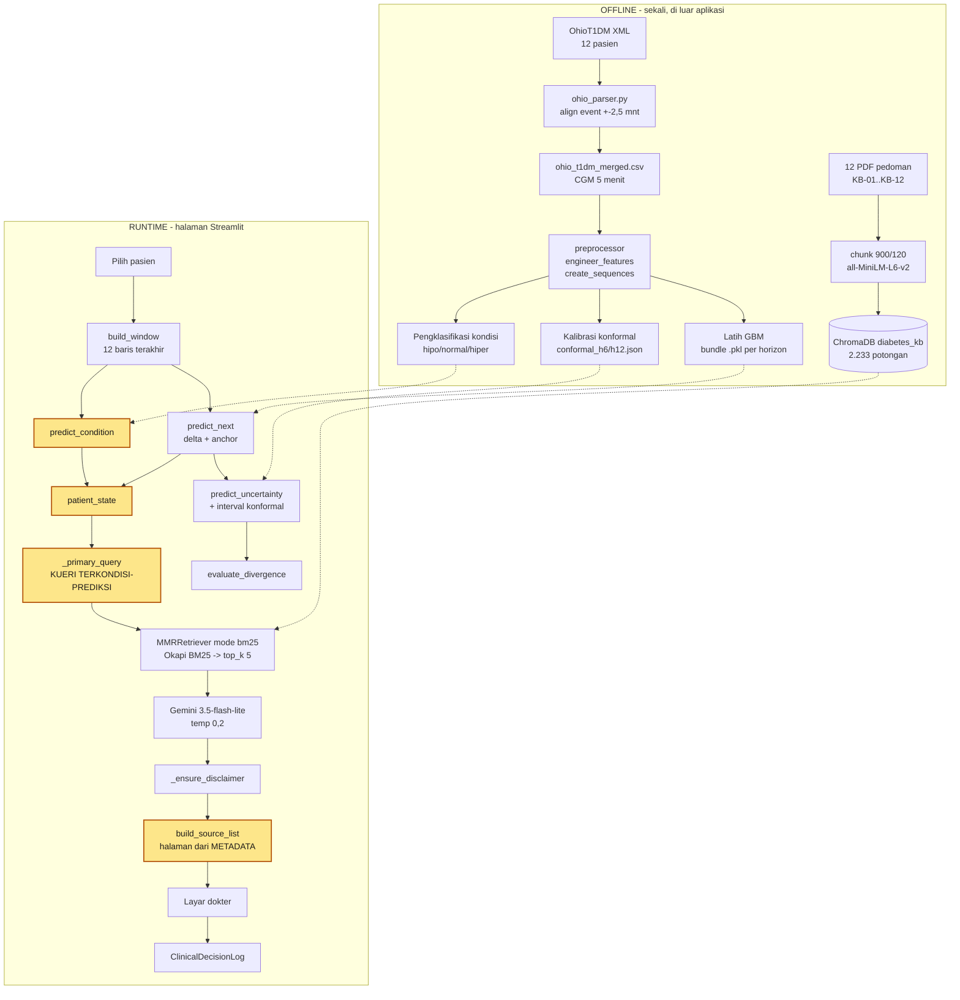

# Metodologi

Dokumen ini memerikan **keputusan metodologis** di balik sistem pada repositori ini: dari
mana datanya, mengapa fiturnya dipilih, mengapa horizonnya 30 dan 60 menit, bagaimana data
dibagi, bagaimana korpus pedoman diindeks dan ditelusuri, serta bagaimana seluruhnya
dievaluasi. Ia melengkapi `README.md`, yang menerangkan cara menjalankan, bukan cara
memilih.

Dua hal yang perlu diketahui sebelum membaca:

- **Angka pada dokumen ini dibaca dari berkas hasil di `results/`, bukan dari ingatan.**
  Bila sebuah angka berselisih dengan berkas hasilnya, berkas hasil yang berlaku.
- **Komponen yang sudah digantikan tetap disebut**, disertai keterangan bahwa ia kini
  berperan sebagai pembanding. Menghapusnya akan membuat angka perbandingan pada laporan
  tidak dapat dilacak kembali ke kode.

## 1. Sumber Dataset

Dataset yang digunakan adalah **OhioT1DM** (Marling & Bunescu, 2020), kumpulan
data Diabetes Tipe 1 dari 12 pasien (kohort 2018: 6 pasien, kohort 2020: 6 pasien)
selama ±8 minggu per pasien.  Data ini dipilih karena:
- Merupakan dataset T1DM multimodal publik dengan CGM, insulin, makanan, dan gaya hidup.
- Diakui sebagai benchmark standar riset prediksi glukosa (bdk. Martinsson et al., 2020).
- Tersedia secara bebas untuk penelitian akademik.

Parser XML (`src/data/ohio_parser.py`, `process_ohio_dataset()`) menghasilkan **dua** CSV:
- `data/raw/ohio_t1dm_merged.csv` — timeline **CGM 5-menit** (untuk pelatihan model).
- `data/raw/ohio_t1dm_smbg.csv` — timeline **`finger_stick` (SMBG nyata)** (untuk skenario SMBG).

Parser meng-*align* event (insulin bolus, basal step-function, makanan, dll.) ke grid CGM
dengan toleransi ±2.5 menit, sehingga fitur `insulin`, `carbs`, dan `basal_rate` benar-benar
terisi (multimodal). Detail perbaikan parser & justifikasinya ada di `docs/journey/`.

## 2. Cadence: CGM (Pelatihan) dan SMBG Nyata (finger_stick)

### 2.1 Data Mentah: CGM 5-menit

OhioT1DM merekam glukosa setiap **5 menit** (Continuous Glucose Monitor / CGM),
menghasilkan ±288 titik/hari per pasien.  Cadence ini jauh lebih padat daripada
kondisi klinis yang menjadi target sistem ini: pasien tanpa CGM yang menggunakan
**Self-Monitoring of Blood Glucose** (SMBG) — pengukuran mandiri beberapa kali per hari.

### 2.2 Justifikasi Penggunaan Data CGM untuk Pelatihan

Model dilatih pada **data CGM (5-menit)** dengan alasan:

1. **Kualitas sinyal** — resolusi temporal CGM cukup untuk menangkap tren glukosa
   postprandial dan nocturnal yang informatif bagi model prediktif.
2. **Volume data** — ±166 ribu baris memberi cukup contoh untuk melatih model;
   timeline SMBG jauh lebih sedikit (±4.5 ribu baris).
3. **Kinerja empiris** — pada horizon standar BGLP, RF mencapai RMSE **22.7 mg/dL**
   (+30 menit) dan **34.5 mg/dL** (+60 menit), sebanding dengan literatur OhioT1DM,
   menjadi *baseline* untuk perbandingan LSTM (T4).

`sequence_length = 12` pada cadence 5-menit = **jendela look-back 1 jam**,
cukup untuk menangkap dinamika postprandial (puncak glukosa umumnya 45–90 menit
setelah makan, ADA 2023).

### 2.3 SMBG Nyata (finger_stick), Bukan Simulasi

OhioT1DM **sudah memuat pembacaan SMBG nyata** melalui kanal `<finger_stick>`
(±397 pembacaan/pasien). Maka skenario SMBG memakai **data nyata ini** langsung
(`ohio_t1dm_smbg.csv`), bukan hasil downsampling CGM yang artifisial. Keputusan ini diambil
karena: bila data nyata tersedia, mengartifisialkannya tidak menambah validitas dan justru
menambah asumsi.

> Catatan: fungsi `DataPreprocessor.downsample_smbg()` tetap tersedia sebagai **utilitas
> opsional** (mis. uji robustness), tetapi **bukan basis metodologi** lagi.

| Aspek | CGM (pelatihan) | SMBG nyata (finger_stick) |
|---|---|---|
| Sumber | `<glucose_level>` | `<finger_stick>` |
| Jumlah baris | ±166.533 | ±4.566 |
| Cadence | 5 menit | tidak teratur (beberapa per hari) |
| Peran | Melatih & menguji model | Skenario deployment SMBG |

## 3. Pemilihan Fitur Prediktor

Fitur model = `[glucose, carbs, insulin, activity]` (stres dikeluarkan; lihat bawah).
Pemilihan ini berbasis **dua landasan**: fisiologi/literatur dan bukti empiris dari data.

### 3.1 Landasan Fisiologis & Literatur

Dinamika glukosa darah secara klasik dimodelkan dari interaksi **glukosa–insulin–karbohidrat**:
- **Minimal Model** (Bergman) dan simulator **UVA/Padova** (basis *artificial pancreas*)
  memodelkan glukosa sebagai fungsi insulin & asupan karbohidrat.
- Karya prediksi glukosa berbasis OhioT1DM (mis. Mirshekarian et al., 2017/2019) memakai
  input CGM + insulin + makanan.
- **Aktivitas fisik** didukung sebagai faktor sekunder (olahraga menurunkan glukosa).

> Catatan: sitasi di atas perlu diverifikasi penulis sebelum masuk laporan final.

### 3.2 Bukti Empiris (Feature Importance RF, per horizon)

Importance RF (agregat per fitur) mengonfirmasi urutan yang sesuai fisiologi, dan
menunjukkan kontribusi fitur **meningkat pada horizon lebih panjang**:

| Horizon | glucose | insulin | carbs | activity |
|---|---|---|---|---|
| +5 menit | 99.77% | 0.19% | 0.04% | 0.01% |
| +30 menit | 96.49% | 2.65% | 0.76% | 0.10% |
| +60 menit | 90.05% | 7.53% | 2.27% | 0.15% |

Pada +5 menit, glukosa terakhir mendominasi (tugas ≈ *persistence*), sehingga fitur lain
nyaris tak berkontribusi — salah satu alasan horizon diperpanjang (lihat §4).

### 3.2.1 Fitur Engineered (konfigurasi final)

Fitur mentah per-bin (`carbs`, `insulin`) menyimpan efek yang tertunda & tersebar, sehingga
kontribusinya kecil. Maka fitur final memakai versi **berbasis fisiologi**:
`[glucose, glucose_delta, iob, cob, activity, hour_sin, hour_cos]` + target **Δglukosa**.
- **iob** = Insulin-on-Board (peluruhan ~4 jam), **cob** = Carbs-on-Board (~3 jam) —
  model glukosa-insulin-karbohidrat (Bergman; UVA/Padova).
- **glucose_delta** = tren; **hour_sin/cos** = pola diurnal.

**Dampak akurasi:** ~tidak berubah (RMSE +30 RF 22.70→22.60; LSTM 21.94→22.04) — akurasi
lintas-pasien dibatasi autokorelasi glukosa.

**Dampak struktur model (penting):** importance jadi benar-benar multimodal —

| Fitur | Baseline (+30) | Engineered (+30) |
|---|---|---|
| glukosa (level) | 96.49% | 23.08% |
| glucose_delta | — | 39.53% |
| iob (insulin) | 2.65% | 11.90% |
| cob (karbohidrat) | 0.76% | 10.38% |
| hour_sin+cos | — | 14.68% |
| activity | 0.10% | 0.44% |

Kontribusi insulin+karbohidrat naik dari ~3.4% → **~22.3%** → klaim "prediksi multimodal"
terbukti empiris.

### 3.3 Stres Dikeluarkan

OhioT1DM hanya memuat **7 event stressor** di seluruh 12 pasien → kolom `stress`
nol-varians dan tak informatif. Karena itu `stress` **dikeluarkan dari fitur model**, namun
**tetap dipertahankan** sebagai butir logbook yang relevan saat penerapan.
Sinyal *sensor band* (heart rate, GSR, suhu kulit, step count) **sengaja tidak dipakai**
(kompleksitas + ketersediaan berbeda antar-kohort) → dicatat sebagai future work.

## 4. Horizon Prediksi

Sistem memprediksi glukosa pada **horizon +30 menit dan +60 menit**, atas **dua dasar
yang berdiri sendiri**. Keduanya perlu disebut, karena dasar kedua sering ditanyakan dan
tidak dapat dijawab oleh dasar pertama.

### 4.1 Dasar klinis — horizon harus menyisakan waktu bagi tindakan untuk bekerja

Horizon prediksi tidak boleh lebih pendek daripada lingkar tindakan klinisnya. Angka
berikut berasal dari korpus pedoman penelitian ini sendiri:

| Sumber | Hal. | Isi |
|---|---|---|
| KB-09 (ISPAD Ch12) | 1323 | Setelah tatalaksana hipoglikemia awal, glukosa **diperiksa ulang dalam 15 menit** *(tingkat bukti E)* |
| KB-09 | 1329 | Karbohidrat kerja cepat 0,3 g/kg menaikkan glukosa **1–1,3 mmol/L dalam 10 menit**, **2–2,1 mmol/L dalam 15 menit** |
| KB-01 (IDAI) | 14 | Insulin kerja cepat: awitan **5–15 menit**, puncak **30–90 menit** |
| KB-01 | 23 | Analog kerja cepat diberikan **15–20 menit sebelum makan** |

Lingkar tindakannya: dokter memutuskan → pasien bertindak (karbohidrat berefek 10–15
menit; insulin berawitan 5–15 menit) → diperiksa ulang pada menit ke-15.

- **+30 menit** adalah horizon terpendek yang masih menyisakan waktu untuk bertindak
  **dan** memverifikasi hasilnya.
- **+60 menit** membentang tepat pada **puncak kerja insulin kerja cepat (30–90 menit)** —
  jendela ketika koreksi berlebihan berubah menjadi hipoglikemia.
- **+5 menit ditolak** atas dua alasan: secara statistik ia setara *persistence* sehingga
  fitur multimoda tidak berkontribusi (§3.2), dan secara klinis belum ada tindakan apa pun
  yang sempat berefek pada rentang itu.

### 4.2 Dasar keterbandingan — konvensi literatur

Kedua horizon tersebut lazim dipakai penelitian prediksi glukosa di atas OhioT1DM,
sehingga hasil dapat disandingkan dengan literatur terdahulu.

> **PERINGATAN SITASI (14 Agustus 2026).** Seluruh halaman
> `docs/OhioT1DM-dataset-paper.pdf` (Marling & Bunescu, 2020) sudah disapu untuk kalimat
> yang memuat "30/60 menit" bersama kata kunci horizon — **nol hasil**. Paper itu
> mendeskripsikan dataset dan menyebut BGLP Challenge, tetapi **tidak pernah menyatakan
> horizon prediksinya**.
>
> **Konsekuensi:** sitasi *"mengikuti konvensi BGLP Challenge (Marling & Bunescu, 2020)"*
> pada Batasan 3 (Bab I), Subbab II.4.3, dan Subbab III.3.3 **tidak ditopang sumber yang
> dirujuknya**, dan harus diganti sebelum laporan final.
>
> Kandidat yang perlu diverifikasi (buka berkasnya, pastikan kalimatnya benar-benar ada):
> Ghimire dkk. (2024), Woldaregay dkk. (2019), atau prosiding BGLP Challenge itu sendiri
> (KDH@IJCAI-ECAI 2018 / KDH@ECAI 2020). **Jangan mengutip sebelum diverifikasi** — itu
> persis kekeliruan yang sedang diperbaiki di sini.

### 4.3 Horizon yang lebih panjang: dipertimbangkan dan ditolak dengan angka

Korpus mencatat risiko hipoglikemia bertahan **sampai 24 jam** setelah olahraga (KB-01
hal. 37), memuncak **7–11 jam** kemudian pada olahraga sore (KB-11 hal. 1345). Itu
menimbulkan pertanyaan wajar: mengapa horizonnya tidak diperpanjang?

Jawabannya terukur:

| | +30 mnt | +60 mnt |
|---|---:|---:|
| RMSE (GBM) | 20,81 | 32,24 |
| Clarke A+B | 95,19% | 88,07% |
| **Lebar interval konformal 95%** | 81,6 mg/dL | **133,2 mg/dL** |

Rentang sasaran klinis 70–180 mg/dL lebarnya **110 mg/dL**. Pada +60 menit interval
prediksi **sudah lebih lebar daripada seluruh rentang sasaran**, sehingga tidak dapat
menyingkirkan hipoglikemia maupun hiperglikemia. Memperpanjang horizon menghilangkan daya
bedanya.

**Lebih pokok: horizon bukan alat yang tepat untuk efek tertunda.** Penyebabnya berada di
masa lalu, bukan di masa depan. Sistem ini sudah memakai pola yang benar dua kali — insulin
bekerja 4–6 jam dan direpresentasikan sebagai **IOB**, karbohidrat ~3 jam sebagai **COB**,
keduanya tanpa memperpanjang horizon. Padanan itu **belum ada untuk aktivitas fisik**, dan
parser bahkan membuang atribut `duration` dari kanal `<exercise>` sehingga hanya skor
intensitas yang tersisa — kontribusinya terukur **0,18%**. Diangkat sebagai saran
pengembangan pada Bab VII, bukan dikerjakan di sini.

### 4.4 Konfigurasi

`prediction_horizons: [6, 12]` (langkah 5-menit), `default_horizon: 6` (bundle aplikasi
memakai +30 menit). Untuk SMBG (`finger_stick`), horizon mengikuti pembacaan berikutnya.

## 5. Train/Test Split

Pembagian data dilakukan **per pasien** (bukan per baris) untuk menghindari
data leakage temporal.

**Dataset memakai seluruh 12 pasien OhioT1DM; tidak ada pasien yang dibuang.**
Tidak ada kriteria eksklusi pasien di kode mana pun.

- **Train**: 10 pasien
- **Test**: 2 pasien hold-out — `ohio_591` dan `ohio_596`, dipilih lewat
  `patient_ids[-2:]` pada daftar terurut

Fungsi: `DataPreprocessor.split_by_patient(df, test_patients=[...])`.

> **KOREKSI (Agustus 2026).** Versi sebelumnya menulis *"Train: 80% pasien (8 dari 10
> yang digunakan)"*. Itu keliru dan tidak didukung kode. Angka **8** hanya berlaku pada
> `scripts/conformal_calibration.py`, yang memakai pembagian **tiga arah** khusus untuk
> kalibrasi conformal: `pids[:-4]` = 8 latih, `pids[-4:-2]` = 2 kalibrasi,
> `pids[-2:]` = 2 uji. Pembagian itu tidak dipakai pelatihan model utama.
>
> Verifikasi: `data/raw/ohio_t1dm_merged.csv` memuat 166.533 baris dari 12 pasien
> (ohio_540, 544, 552, 559, 563, 567, 570, 575, 584, 588, 591, 596), seluruhnya
> diparse dari 24 berkas XML (12 pasien × training + testing).

Normalisasi (`StandardScaler`) di-*fit* hanya pada data training dan di-*transform*
pada data test.

## 6. Reproduksi

> **Diperbarui 13 Agustus 2026.** Butir 2 semula melatih **Random Forest**. Prediktor
> produksi kini **Gradient Boosting** (`config.yaml` `model.name: "GradientBoosting"`),
> sehingga perintahnya berubah. Jalur RF **tetap ada** dan tetap berjalan — dipakai skrip
> pembanding dan instalasi lama.

```bash
# 1. Parse OhioT1DM XML → 2 CSV (CGM merged + SMBG finger_stick)
python -m src.data.ohio_parser

# 2. Latih model produksi (bundle inferensi untuk aplikasi)
python -m src.models.gbm_model --config config.yaml --data_source ohio_t1dm
#    Jalur lama, masih berjalan:
#    python -m src.models.rf_model --config config.yaml --data_source ohio_t1dm

# 3. Kalibrasi konformal per horizon (WAJIB — tanpa ini interval tidak muncul)
python scripts/conformal_calibration.py --horizon 6
python scripts/conformal_calibration.py --horizon 12

# 4. Pengklasifikasi kondisi (hipo/normal/hiper)
python scripts/train_condition_classifier.py

# 5. Ingesti korpus pedoman ke ChromaDB
python scripts/reingest_kb.py

# 6. Evaluasi komparatif tiga model (RMSE, MAE, Clarke Error Grid)
python scripts/eval_gradient_boosting.py --horizon 6
python scripts/eval_gradient_boosting.py --horizon 12
# Hasil → results/eval_prediksi/

# 7. Jalankan aplikasi
streamlit run app/streamlit_app.py
```

Ketiga artefak pada butir 2–4 **harus sekeluarga**: bundle, faktor konformal, dan
pengklasifikasi memakai scaler yang sama. Mencampur GBM dengan artefak RF akan menghasilkan
prediksi yang tampak wajar tetapi salah skala.

## 7. Alur Lengkap Sistem — dari data mentah sampai layar dokter

> **Ditulis 13 Agustus 2026.** Menggambarkan sistem **sebagaimana kodenya berjalan hari
> ini**, bukan sebagaimana dirancang. Tiap tahap menyebut berkas dan fungsi yang
> mengerjakannya, supaya dapat diperiksa ulang.
>
> **Prediktor produksi saat ini adalah Gradient Boosting** — `config.yaml`
> `model.name: "GradientBoosting"`, diganti dari Random Forest pada 13 Agustus 2026.

### 7.0 Peta ringkas



**Kotak berlatar kuning adalah tahap yang menjadi kontribusi metodologis** (lihat §8.3):
pengklasifikasi kondisi, perakitan *patient state* yang menyerap ketidakpastian,
transformasi kueri, dan resolusi sitasi dari metadata. Sisanya komponen baku.

#### Kontrak data antar-tahap

Flow di atas baru dapat diperiksa bila jelas **objek apa** yang berpindah antar-tahap.
Tabel berikut menyatakannya; kolom terakhir menunjuk tempat memeriksanya di kode.

| # | Tahap | Masukan | Keluaran | Diperiksa di |
|---|---|---|---|---|
| 1 | Parse | 24 berkas XML | 2 CSV: `ohio_t1dm_merged.csv` (CGM 5 mnt), `ohio_t1dm_smbg.csv` (`finger_stick`) | `src/data/ohio_parser.py` |
| 2 | Rekayasa fitur | tabel per pasien | + kolom `iob`, `cob`, `glucose_delta`, `hour_sin`, `hour_cos` | `preprocessor.engineer_features` |
| 3 | Pembentukan jendela | tabel berfitur | `X` (n, 12, 7), `y`, `anchor` — jendela berjeda > 30 mnt **dibuang** | `preprocessor.create_sequences` |
| 4 | Pelatihan | `X`, `y − anchor` | bundle `.pkl`: model titik + 2 model kuantil + scaler + daftar fitur | `src/models/gbm_model.py` |
| 5 | Kalibrasi | model + 2 pasien kalibrasi | `conformal_h{6,12}.json` berisi faktor `q` per tingkat | `scripts/conformal_calibration.py` |
| 6 | Ingesti korpus | 12 PDF + `manifest.csv` | 2.233 potongan di ChromaDB, tiap potongan membawa `halaman_cetak` | `scripts/reingest_kb.py` |
| 7 | Prediksi *runtime* | 12 baris terakhir | `pred` (mg/dL), `sigma`, `(lo, hi)` | `app/streamlit_app.py` |
| 8 | Kondisi | jendela yang sama | `predicted_condition` ∈ {hipo, normal, hiper} | `predict_condition` |
| 9 | **Perakitan state** | `pred`, `(lo, hi)`, `predicted_condition` | `PatientState` — `risk_level` dari **nilai TERPREDIKSI**; `anticipated_conditions` diperluas oleh batas interval | `src/patient_state.py` |
| 10 | **Transformasi kueri** | `PatientState` | `primary_query` (untuk retriever) + `llm_context` (untuk prompt) | `_primary_query` |
| 11 | Penelusuran | `primary_query` | 5 potongan + metadata sitasi | `MMRRetriever.retrieve` (mode `bm25`) |
| 12 | Pembangkitan | potongan + `llm_context` | teks rekomendasi dengan penanda `[S1..Sn]`, **tanpa nomor halaman** | `src/rag/prompts.py` |
| 13 | Sitasi | metadata potongan | `page_label` ("Hal. 48"), cuplikan, teks utuh | `src/rag/citations.py` |
| 14 | Keluaran akhir | seluruh di atas | layar dokter + `ClinicalDecisionLog` berisi **sumber persis yang dilihat** | `src/clinical_state/decision_log.py` |

**Tiga sifat yang harus terbaca dari tabel ini**, karena ketiganya adalah klaim penelitian:

1. **Tahap 9 memakai nilai terprediksi, bukan nilai sekarang.** Di situlah letak sifat
   antisipatif; bila baris itu memakai `current_glucose`, seluruh kontribusi batal.
2. **Tahap 12 tidak pernah menerima nomor halaman.** Model bahasa tidak dapat mengarang
   angka yang tak pernah dilihatnya; nomor halaman baru muncul pada tahap 13 dari metadata.
3. **Tahap 14 menyimpan sumber yang persis dilihat dokter**, bukan hasil penelusuran
   mentah — sehingga keputusan dapat diaudit ke halaman dokumen di kemudian hari.

---

### 7.1 OFFLINE — Ingesti data pasien

| | |
|---|---|
| masukan | `data/raw/OhioT1DM/**.xml` — 12 pasien, ±8 minggu masing-masing |
| pengerjaan | `src/data/ohio_parser.py` → `process_ohio_dataset()` |
| keluaran | `data/raw/ohio_t1dm_merged.csv` (CGM 5 menit) dan `ohio_t1dm_smbg.csv` (`finger_stick`) |

Parser meng-*align* kejadian (bolus insulin, basal *step-function*, makanan, aktivitas) ke
grid CGM dengan toleransi **±2,5 menit**, sehingga kolom `insulin`, `carbs`, dan `basal_rate`
benar-benar terisi. Tanpa itu, klaim "multimodal" tidak berdiri.

### 7.2 OFFLINE — Ingesti korpus pedoman

| | |
|---|---|
| masukan | 12 PDF pedoman klinis, `KB-01` … `KB-12` (PERKENI, ADA, IDAI) |
| pengerjaan | `scripts/reingest_kb.py` → `src/rag/knowledge_base.py` |
| keluaran | ChromaDB `models/chroma_db`, koleksi `diabetes_kb`, **2.233 potongan** |

`chunk_size` **900** karakter, `chunk_overlap` **120**, *embedding* **`all-MiniLM-L6-v2`**
(384 dimensi, CPU). Nomor halaman cetak disimpan sebagai **metadata tiap chunk** — inilah
yang kelak menjadi rujukan, bukan angka yang ditulis LLM.

> **Batas yang wajib disertakan.** `all-MiniLM-L6-v2` memotong pada **256 token** tanpa
> peringatan, sehingga pada `chunk_size` 900 sekitar **8,23% token korpus** tidak pernah
> masuk ke vektor. Lihat `docs/DAFTAR_KETERBATASAN.md`.

### 7.3 OFFLINE — Rekayasa fitur dan pelatihan

Urutannya, seluruhnya di `src/data/preprocessor.py` kecuali disebut lain:

1. **`DiabetesDataLoader.load_csv()`** memuat CSV.
2. **`validate_data_contract()`** (`src/data/contracts.py`) menghentikan proses lebih awal
   bila kolom wajib (`patient_id`, `timestamp`, `glucose`) hilang atau salah tipe.
3. **`handle_missing_values()`**.
4. **`engineer_features()`** menghasilkan empat fitur turunan:

   | fitur | cara hitung |
   |---|---|
   | `iob` | akumulasi peluruhan eksponensial bolus insulin, `exp(−Δt / insulin_tau_min)`, τ **240 menit** |
   | `cob` | akumulasi peluruhan karbohidrat, τ **180 menit** |
   | `glucose_delta` | selisih glukosa sepanjang `trend_steps` **3** langkah |
   | `hour_sin`, `hour_cos` | pengkodean siklik waktu-dalam-hari (*dawn phenomenon*) |

   Fitur akhir: `glucose, glucose_delta, iob, cob, activity, hour_sin, hour_cos`.

   > Kepekaan terhadap kedua τ **sudah diukur** (T1.4): rentang RMSE seluruh sapuan hanya
   > **0,106 mg/dL**, jauh di bawah ambang kepekaan — pemilihan τ dari literatur **tidak
   > menentukan hasil**.

5. **`create_sequences(sequence_length=12, horizon, max_gap_steps=6)`** membentuk jendela
   *look-back* satu jam. **`max_gap_steps` 6 (30 menit) adalah penjaganya:** jendela yang
   memuat jeda sensor lebih panjang dari itu **dibuang, bukan diinterpolasi**.
6. **`normalize_data()`** — scaler disimpan bersama model, karena keduanya harus sekeluarga.
7. **Pelatihan** `src/models/gbm_model.py`. Model memprediksi **delta**, bukan nilai
   absolut; nilai akhir direkonstruksi dengan menambahkan glukosa terakhir jendela
   (*anchor*).

Tiga artefak dihasilkan, dan ketiganya harus **sekeluarga**:

| artefak | berkas |
|---|---|
| bundle inferensi per horizon | `models/gbm_inference_bundle_h6.pkl`, `..._h12.pkl` |
| faktor konformal per horizon | `results/eval_prediksi/conformal_h6.json`, `..._h12.json` |
| pengklasifikasi kondisi | `models/gbm_condition_classifier_h6.pkl` |

---

### 7.4 RUNTIME — Halaman Konsultasi (`app/streamlit_app.py`)

#### Langkah 1 — Muat artefak, per KELUARGA model

`load_horizons()` memilih **satu keluarga** untuk seluruh horizon, prioritas `GBM → RF`.
Ini disengaja: mencampur h6 dari GBM dengan h12 dari RF akan menampilkan dua horizon dari
dua model berbeda pada satu halaman, **dan dokter tidak punya cara mengetahuinya**.

#### Langkah 2 — Pilih pasien, dan (opsional) sertakan logbook

Bila dokter mencentang *"Sertakan catatan logbook"*:

1. `baca_logbook()` → `gabung_dengan_dataset()` menggabungkan catatan manual ke deret CGM
   menurut stempel waktunya.
2. **`periksa_kelayakan()`** memeriksa jendela gabungan terhadap **kriteria kerapatan yang
   sama** dengan yang dipakai saat melatih — `max_gap_steps` dibaca dari `config.yaml`,
   bukan ditulis ulang.
3. Bila **TIDAK LAYAK**, aplikasi **kembali ke deret dataset saja dan mengatakan alasannya**.

> Ia **tidak menginterpolasi** jeda supaya jendelanya terlihat rapat. Menginterpolasi jeda
> berjam-jam menghasilkan baris yang tampak sah bagi dokter padahal karangan.

#### Langkah 3 — Jendela fitur

`build_window()` menghitung ulang fitur turunan lalu mengambil **12 baris terakhir**.

#### Langkah 4 — Prediksi, per horizon

Untuk **tiap** horizon (+30 dan +60 menit):

| | |
|---|---|
| `predict_next()` | prediksi delta, lalu ditambah *anchor* |
| `predict_uncertainty()` | σ per sampel |
| `prediction_interval()` | interval 95% memakai **faktor konformal horizon itu sendiri** |

σ dihitung berbeda menurut keluarga model:

| keluarga | cara | alasan |
|---|---|---|
| GBM | `quantile_spread` — rentang dua model kuantil ÷ 3,92 | `HistGradientBoostingRegressor` **tidak punya** `estimators_` |
| RF | `tree_variance` — sebaran antar-pohon | tersedia bawaan |

Keduanya **heuristik dengan status yang sama**: jaminan cakupan konformal tidak bergantung
pada bagaimana σ dipilih, karena kuantil konformal menyerap skalanya. Bila sumber σ tidak
tersedia, fungsinya mengembalikan `None` dan pemanggil **wajib menyatakan intervalnya belum
terkalibrasi** — bukan menampilkan interval dengan σ tebakan.

Tiap horizon memakai faktornya sendiri: prediksi 60 menit jauh lebih tidak pasti daripada
30 menit, sehingga satu faktor untuk keduanya **pasti keliru pada salah satunya**.

#### Langkah 5 — Kondisi masa depan, dan peringatan divergensi

`predict_condition()` menjalankan **pengklasifikasi terpisah** (hipo/normal/hiper), bukan
mengambangkan nilai regresi. Alasannya terukur: regresi yang meminimalkan galat kuadrat
menyusut ke tengah sehingga jarang melewati ambang 70/180 — sensitivitas hipoglikemianya
hanya **14%**, sedangkan pengklasifikasi sadar-biaya mencapai **44%** pada ambang klinis
standar.

`evaluate_divergence()` (`src/alerts.py`) membandingkan kondisi **sekarang** dengan kondisi
**terprediksi**, dan memunculkan peringatan bila keduanya berbeda — inilah kasus yang menjadi
sasaran utama sistem.

#### Langkah 6 — Kueri terkondisi-prediksi (inti kontribusi)

Dokter menekan **"Buat rekomendasi klinis"**. Aplikasi menyusun `patient_state`, lalu
memanggil `RAGPipeline.answer(patient_state, prediction, timer)`.

`PredictionConditionedQueryBuilder._primary_query()` (`src/rag/conditioned_query.py`)
membentuk kueri penelusuran dari **nilai yang DIPREDIKSI**, bukan kondisi saat ini:

```
Prediksi glukosa 30 menit ke depan: 58.0 mg/dL (dari 112.0 mg/dL, perubahan -54.0 mg/dL,
tren menurun). Status risiko prediksi: BAHAYA - Hipoglikemia. Faktor kontribusi: tren cepat
menurun, aktivitas fisik rendah. Berikan penilaian risiko, tindakan pencegahan, dan
protokol pemantauan untuk kondisi prediksi glukosa 58 mg/dL ...
```

Dua keputusan rancangan yang dasarnya terukur:

- Kueri dikondisikan pada **kondisi hasil pengklasifikasi**, bukan nilai regresi. Untuk mutu
  penelusuran keduanya setara (p=0,31); yang membedakan adalah pengklasifikasi menangkap
  hipoglikemia jauh lebih baik, sehingga **kueri untuk kasus paling berbahaya lebih sering
  menargetkan kondisi yang benar**.
- Batas interval konformal **sengaja TIDAK** dimasukkan ke kueri. Memasukkannya menaikkan
  cakupan kondisi sebenarnya (94,2%) tetapi **mengencerkan sinyal** sehingga MRR turun ke
  0,753. Interval tetap dipakai — sebagai **peringatan klinis**, bukan bahan kueri.

#### Langkah 7 — Penelusuran

`MMRRetriever.retrieve()` (`src/rag/retriever.py`) menyediakan **tiga cara penelusuran**
yang dipilih lewat `rag.retrieval_mode`, seluruhnya berjalan atas potongan yang sama:

| `retrieval_mode` | mekanisme | status |
|---|---|---|
| `vektor` | kemiripan makna + penataan ulang MMR (`fetch_k` 12, `lambda_mult` 0,0) | dipertahankan sebagai pembanding |
| **`bm25`** | **pembobotan Okapi BM25 atas 2.233 potongan** | **jalur produksi** |
| `hibrida` | penggabungan kedua daftar pada peringkat (RRF, kolam 50, peredam 60) | dipertahankan sebagai pembanding |

`top_k` = **5** potongan diteruskan ke model bahasa pada ketiga cara.

Pemilihan `bm25` ditetapkan oleh pengukuran, bukan di muka. Penelusuran padat bergantung
pada model *embedding* yang memenuhi batasan komputasi penelitian ini, dan model itu
**berbahasa Inggris** sedangkan korpusnya **berbahasa Indonesia**; penggabungan hibrida
tidak menolong karena fusi peringkat tetap memberi bobot pada daftar padat yang keliru.

Bila indeks leksikal gagal dibangun, penelusur mundur ke jalur padat dan **menyatakan
penurunan itu beserta sebabnya**; bila Chroma tidak tersedia sama sekali, pipeline jatuh ke
`SimpleKeywordRetriever` alih-alih gagal senyap.

> **Batas yang wajib disertakan.** Sapuan seluruh rentang glukosa 40–400 mg/dL hanya
> menjangkau sebagian kecil korpus. Angka penelusuran sah sebagai perbandingan
> antar-konfigurasi, **bukan** sebagai gambaran mutu korpus secara keseluruhan.

#### Langkah 8 — Generasi

`generator.generate_advisory()` memanggil **Gemini `gemini-3.5-flash-lite`**, temperature
**0,2**, `max_tokens` **700**. Prompt memuat konteks kuantitatif prediksi (`_llm_context`)
di samping kelima potongan.

`_ensure_disclaimer()` menjamin frasa penyangkalan ada pada keluaran, apa pun yang ditulis
model.

> **Batas yang wajib disertakan (K15).** Pada suhu 0,2 jawaban **tidak tereproduksi**. Dua
> jalan berkonfigurasi identik menghasilkan sepuluh dari sepuluh jawaban yang berbeda, dan
> **satu dari sepuluh kasus** berubah dari menjawab menjadi **menolak menjawab**.

#### Langkah 9 — Rujukan, dan penjaganya

`build_source_list()` (`src/rag/citations.py`) menyusun daftar sumber. **Nomor halaman
diambil dari METADATA chunk, tidak pernah dari teks LLM** — inilah yang membuat rujukannya
tertelusur, bukan hasil karangan model.

Bila daftar sumber **kosong**, halaman menampilkan galat menonjol bahwa teks di bawahnya
**tidak didukung kutipan panduan** dan tidak boleh diperlakukan sebagai rekomendasi
bersumber.

#### Langkah 10 — Waktu tanggap

`StageTimer` (`src/timing.py`) mencatat lima tahap — rekayasa fitur, prediksi, kalibrasi,
kueri+penelusuran, generasi — dan menampilkannya **ujung-ke-ujung** kepada dokter (KNF-10),
dipecah menjadi komputasi lokal lawan menunggu LLM.

#### Langkah 11 — Dokter memutuskan

Tab **"Catat Keputusan"** menyimpan keputusan lewat `ClinicalDecisionLog`
(`src/clinical_state/decision_log.py`) ke `data/processed/patient_states.json`.

Inilah wujud alur **doctor-mediated** (KF-09): sistem **tidak pernah** meneruskan
rekomendasi langsung ke pasien; dokter meninjau dan menyetujui lebih dulu.

---

### 7.5 Dua halaman lain

| halaman | isi |
|---|---|
| `app/pages/1_Input_Logbook.py` | dokter memasukkan catatan manual (glukosa, karbohidrat, insulin, aktivitas, stres, tidur) → `data/raw/manual_logbook.csv` |
| `app/pages/2_Tentang_dan_Validasi.py` | angka validasi, keterbatasan, dan penyangkalan — supaya batas klaim ada **di dalam aplikasi**, bukan hanya di laporan |

### 7.6 Ringkasan satu paragraf

Data CGM OhioT1DM diubah menjadi jendela fitur berdurasi satu jam yang memuat IOB, COB,
tren, dan pola diurnal; jendela yang jeda sensornya melebihi 30 menit dibuang. Gradient
Boosting memprediksi **perubahan** glukosa 30 dan 60 menit ke depan, direkonstruksi menjadi
nilai absolut, lalu dibungkus interval konformal yang faktornya khusus per horizon. Sebuah
pengklasifikasi terpisah menetapkan **kondisi** masa depan, karena regresi terlalu jarang
melewati ambang hipoglikemia. Kondisi terprediksi itulah — bukan kondisi sekarang — yang
menyusun kueri penelusuran ke korpus dua belas pedoman klinis; pembobotan BM25 memilih lima
potongan teratas, dan model bahasa menyusun rekomendasi yang tiap rujukannya bernomor halaman
dari metadata chunk. Dokter melihat prediksi, interval, peringatan divergensi, rekomendasi
bersumber, dan waktu tanggapnya — lalu **dokter yang memutuskan**, dan keputusannya dicatat.

---

## 8. Posisi Metodologis: apa yang DIPERBARUI terhadap penelitian terdahulu

> Pertanyaan yang dijawab bagian ini: **metode apa yang diperbarui terhadap penelitian
> terdahulu, dan di mana letak bedanya.** Penggantian perkakas tidak dihitung sebagai
> pembaruan metode, dan bagian ini menjaga batas itu secara eksplisit.
>
> Karakterisasi penelitian terdahulu di bawah **disarikan dari Bab II laporan**, bukan dari
> pembacaan ulang tiap paper pada sesi ini. Sebelum laporan final, tiap baris perlu
> dicocokkan kembali ke sumbernya.

### 8.0 Struktur rujukan pasca revisi — tiga lapis

Penting dinyatakan lebih dulu, karena kerangka *digital twin* sudah dihapus dan
posisi tiap rujukan berubah.

| Lapis | Rujukan | Peran |
|---|---|---|
| **Jangkar metodologis** | **Kresevic dkk. (2024)**, *npj Digital Medicine* 7(1):102 | fondasi — objek yang ditelusuri sama (dokumen pedoman klinis) dan tujuannya sama (rekomendasi yang dibumikan pada pedoman). **Menggantikan Sarani Rad** |
| **Metodologi penelitian** | **Peffers dkk. (2007)** — *Design Science Research Methodology* | enam aktivitas DSRM dipetakan ke tujuh bab laporan |
| **Kerangka konseptual sistem** | **Sutton dkk. (2020)** — definisi CDSS | menggantikan seluruh kerangka *digital twin* yang dihapus |

**Sarani Rad dkk. (2024) tetap ada, tetapi statusnya turun.** Kini ia berperan sebagai
**kasus pembanding berinfrastruktur berat** — contoh pendekatan yang efektif tetapi
mensyaratkan PHKG, HL7 FHIR, dan SPARQL sehingga tidak layak pada lingkungan bersumber
daya terbatas. **Bukan lagi fondasi yang dilanjutkan.**

Untuk pembedaan kebaruan dipakai dua rujukan tambahan:

| Rujukan | Fungsinya |
|---|---|
| **Gao dkk. (2023)** | menempatkan kontribusi pada keluarga teknik **transformasi kueri pra-penelusuran** — bukan arsitektur RAG baru |
| **Jiang dkk. (2023)** — FLARE | pembanding pendekatan antisipatif yang mengondisikan pada **prediksi model bahasa atas teksnya sendiri**, bukan pada prediktor eksternal |

> **Catatan atas cara membaca tabel di atas.** Kedudukan sebuah rujukan pada penelitian ini
> **tidak** ditentukan oleh frekuensi sitasinya. Pencacahan langsung menunjukkan Kresevic
> dkk. muncul sesering Gao dkk. dan Lewis dkk. pada Bab I, sehingga frekuensi tidak dapat
> dipakai untuk menyatakan salah satunya lebih mendasar. Yang menentukan adalah **peran**
> masing-masing, sebagaimana kolom terakhir tabel.

### 8.1 Cara membaca bagian ini

Perbedaan **perkakas** adalah mengganti pustaka, model, atau layanan: RF → GBM, Ollama →
Gemini, FAISS → ChromaDB. Penggantian semacam itu **bukan kebaruan** dan tidak diklaim
sebagai kebaruan di penelitian ini.

Perbedaan **metode** adalah mengubah *prosedur*: apa yang menjadi masukan suatu tahap, dari
mana suatu keputusan diturunkan, dan apa yang diukur untuk membuktikannya. Bagian ini
membatasi diri pada perbedaan jenis kedua.

Ujinya sederhana: **kebaruan metodologis tidak dapat diperoleh dengan mengganti pustaka.**
Setiap butir di §8.4 dan §8.5 lolos uji itu.

### 8.2 Metodologi penelitian terdahulu

Penelitian terdahulu terbagi ke dalam tiga arah yang **berkembang tanpa saling bertaut**.

| Arah | Wakil | Prosedurnya | Keluaran akhir | Prasyarat |
|---|---|---|---|---|
| **A. Prediksi glukosa berbasis data** | Woldaregay dkk. (2019); Ghimire dkk. (2024) | jendela deret waktu → model → nilai glukosa pada horizon | **satu angka** | dataset deret waktu |
| **B. Representasi pengetahuan terstruktur** | Sarani Rad dkk. (2024) | data pasien → ontologi selaras HL7 FHIR → **kueri SPARQL bertemplat tetap** → layanan personal | jawaban tentang **data pasien yang terekam** | EHR terintegrasi, ontologi formal, CGM |
| **C. RAG di atas pedoman klinis** | Kresevic dkk. (2024); Lee dkk. (2024); Wang dkk. (2024) | pertanyaan pengguna **atau kondisi yang sedang berlaku** → penelusuran → pembangkitan | teks rekomendasi | korpus dokumen |

Satu pendekatan lain perlu dibedakan secara khusus karena **tampak** serupa:

| | FLARE — Jiang dkk. (2023) | Penelitian ini |
|---|---|---|
| Sifat | antisipatif | antisipatif |
| **Sumber pengondisiannya** | prediksi **model bahasa atas kalimat yang akan ia tulis sendiri** | **prediktor eksternal atas kondisi fisiologis pasien pada waktu yang akan datang** |
| Yang diantisipasi | kebutuhan tekstual | kejadian klinis |

**Pola yang berulang:** arah A menghasilkan taksiran masa depan lalu **berhenti pada
angka**; arah B dan C menghasilkan rekomendasi tetapi **kuerinya bersumber dari keadaan
yang sudah teramati**. Tidak ada yang menjadikan taksiran kondisi masa depan sebagai
**sumber kueri penelusuran panduan**.

### 8.2a Jangkar metodologis — apa yang Kresevic dkk. (2024) BENAR-BENAR kerjakan

> Disarikan dari pembacaan langsung berkas
> `17_Kresevic-2024_Optimization of Hepatological Clinical Guidelines Interpretation...pdf`
> (9 halaman), bukan dari ringkasan sekunder.

| Aspek | Isi |
|---|---|
| Ranah | infeksi **Hepatitis C** kronis (hepatologi), pengelolaan menurut pedoman EASL |
| Model bahasa | **GPT-4 Turbo** (OpenAI), berbayar |
| **Yang dioptimalkan** | **FORMAT pedomannya** — mencari bentuk paling mudah diproses LLM, termasuk **mengubah tabel menjadi daftar berbasis teks** |
| Rancangan percobaan | ablasi berjenjang: model dasar → pedoman sebagai konteks → pedoman diformat ulang → *few-shot* (54 pasang tanya-jawab) |
| **Isi prompt** | skenario klinis baku berisi **nilai laboratorium dan pencitraan yang diekstrak langsung dari EHR** |
| Parameter | temperature **0,9**, maksimum **800** token |
| Luaran utama | **akurasi kualitatif menurut penilaian pakar** terhadap pedoman EASL |
| Luaran sekunder | skor kemiripan teks: BLEU, ROUGE-L, METEOR, dan skor OpenAI khusus |
| Skala | 20 pertanyaan, tiap pertanyaan diulang 5 kali |
| Temuan pokok | model dasar akurat **43,0%**; kerangka mereka mendekati sempurna. **Skor kemiripan TIDAK mencerminkan akurasi terhadap penilaian pakar**, karena mengukur tumpang tindih kata, bukan kebenaran faktual |

**Dua hal dari tabel ini yang menentukan letak perbedaannya.**

Pertama, **yang dioptimalkan Kresevic adalah sisi KORPUS** — bagaimana pedoman disajikan
agar LLM membacanya dengan benar. Penelitian ini tidak menyentuh sisi itu; yang diubah
adalah **sisi KUERI** — dari mana kondisi yang ditanyakan berasal. Keduanya bekerja pada
tahap yang berbeda pada pipa yang sama, sehingga **saling melengkapi, bukan bersaing**.

Kedua, baris "isi prompt" **memastikan** karakterisasi pada Bab II bukan asumsi: prompt
Kresevic diisi nilai laboratorium dan pencitraan **terkini**. Pengondisiannya memang pada
keadaan yang sudah terukur.

#### Perbandingan langsung terhadap jangkar

| | Kresevic dkk. (2024) | **Penelitian ini** |
|---|---|---|
| Tahap yang diubah | **format korpus** (pra-pengindeksan) | **sumber kueri** (pra-penelusuran) |
| Sumber kondisi pada prompt | nilai lab & pencitraan **terkini** dari EHR | **kondisi yang diprediksi** 30–60 menit ke depan |
| Arah waktu | reaktif terhadap keadaan terukur | **antisipatif** |
| Prasyarat data | **EHR terintegrasi** | **logbook periodik** — tanpa EHR, tanpa CGM |
| Model bahasa | GPT-4 Turbo (berbayar) | Gemini 3.5-flash-lite (berjenjang gratis) |
| Temperature | **0,9** | **0,2** — sengaja rendah untuk menekan pengarangan angka dosis |
| Ketidakpastian prediksi | tidak ada modul prediksi | **interval konformal ikut mengondisikan kueri** |
| Sumber nomor halaman sitasi | tidak dibahas | **metadata potongan; LLM tidak pernah melihat angkanya** |
| Penilaian mutu | akurasi kualitatif oleh pakar | metrik penelusuran + RAGAS + Clarke Error Grid |
| Ranah | Hepatitis C | Diabetes Melitus Tipe 1 |

### 8.3 Metodologi yang diajukan — sebagai prosedur

**Nama metode: *query transformation* terkondisi-prediksi.**

Masukan: jendela catatan *logbook* periodik.
Keluaran: rekomendasi berbahasa Indonesia yang dibumikan pada pedoman dan tertelusur
sampai nomor halaman cetak.

| # | Langkah | Isi | Baru? |
|---|---|---|---|
| 1 | Rekayasa *state* fisiologis | kejadian diskret → besaran yang **meluruh** (IOB τ 240 mnt, COB τ 180 mnt), tren, penyandian siklis waktu | tidak — lazim |
| 2 | Penyaringan kesinambungan | jendela yang memuat jeda antar-baris melebihi batas **dibuang, bukan diinterpolasi** | tidak — praktik baik |
| 3a | Regresi | memprediksi **Δglukosa**, direkonstruksi dengan *anchor* | tidak |
| 3b | **Pengklasifikasi kondisi sadar-biaya** | kelas kondisi masa depan diprediksi **langsung**, menggantikan pengambangan nilai regresi | **ya** |
| 4 | Kuantifikasi ketidakpastian | σ per sampel → interval konformal, faktor **per horizon** | tidak — Angelopoulos & Bates |
| 5 | **Pembentukan himpunan kondisi yang diantisipasi** | A = {kondisi terprediksi} ∪ {hipoglikemia bila batas bawah < 70} ∪ {hiperglikemia bila batas atas > 180} | **ya** |
| 6 | **Transformasi kueri** | kueri disusun dari A dan nilai terprediksi — **bukan** dari glukosa saat ini, bukan dari pertanyaan pengguna | **ya — inti kontribusi** |
| 7 | Penelusuran | pembobotan Okapi BM25, lima potongan teratas | tidak — Robertson dkk. |
| 8 | **Pembangkitan berpagar** | blok konteks memuat penanda `[S1..Sn]` **tanpa nomor halaman**; nomor halaman diresolusi lapisan antarmuka dari metadata potongan | **ya (metode keselamatan)** |
| 9 | Penegakan pengaman | disclaimer dijamin ada; penanda *grounded*; keputusan dokter dicatat bersama sumber yang **persis dilihatnya** | sebagian |

Langkah **3b, 5, 6, dan 8** adalah yang diperbarui. Sisanya diadopsi apa adanya dan
disebutkan sumbernya.

### 8.4 Di mana bedanya — perbandingan langsung

| Aspek metodologis | Arah A | Arah B (Sarani Rad) | Arah C (Kresevic dkk.) | **Penelitian ini** |
|---|---|---|---|---|
| **Sumber kueri penelusuran** | — | template SPARQL tetap | kondisi berlaku / pertanyaan pengguna | **keluaran prediktor eksternal atas kondisi masa depan** |
| Objek yang ditelusuri | — | graf data pasien | dokumen pedoman | dokumen pedoman |
| Pertanyaan yang terjawab | "berapa nilainya nanti?" | "bagaimana keadaan pasien?" | "apa kata pedoman untuk kondisi ini?" | **"apa kata pedoman untuk kondisi yang AKAN terjadi?"** |
| Bentuk kondisi yang mengondisikan | — | nilai terekam | nilai terobservasi | **kelas kondisi dari pengklasifikasi, bukan ambang atas regresi** |
| Ketidakpastian prediksi ikut mengondisikan penelusuran | — | — | tidak | **ya — langkah 5** |
| Sumber nomor halaman sitasi | — | — | umumnya keluaran model | **metadata potongan; model tidak pernah melihat angkanya** |
| Prasyarat infrastruktur | dataset | **EHR + ontologi + CGM** | korpus | **korpus + logbook periodik** |

**Tiga kalimat yang dapat dipakai menjawab penguji:**

1. *Yang diperbarui adalah **sumber kueri penelusuran**.* Pada seluruh kerangka RAG klinis
   terdahulu, kueri dibangun dari kondisi yang sedang berlaku atau dari pertanyaan
   pengguna. Di sini kueri dibangun dari kondisi yang **diprediksi akan terjadi** oleh
   prediktor eksternal.
2. *Yang diperbarui adalah **bentuk pengondisiannya**.* Bukan nilai numerik yang
   diteruskan, melainkan **kelas kondisi** — dan kelas itu berasal dari pengklasifikasi
   sadar-biaya, bukan dari pengambangan nilai regresi, karena regresi terbukti terlalu
   jarang melewati ambang hipoglikemia.
3. *Yang diperbarui adalah **masuknya ketidakpastian ke dalam penelusuran**.* Kondisi
   berisiko yang masih tercakup interval konformal tetap ditelusuri dokumennya meskipun
   prediksi titiknya normal.

### 8.5 Kebaruan pada metodologi EVALUASI

Ini bagian yang paling menjawab kekhawatiran *"hanya tukar perkakas"*: **kontrol berikut
tidak dapat diperoleh dengan mengganti pustaka mana pun.** Semuanya adalah rancangan
percobaan.

| Kontrol | Mengapa diperlukan | Akibat bila tidak ada |
|---|---|---|
| **Struktur kueri identik antar-lengan** | agar ablasi mengukur **sumber pengondisian**, bukan perbedaan bentuk kalimat | selisih terbaca sebagai keunggulan metode padahal berasal dari perbedaan kata |
| **Sumber kondisi wajib eksplisit** | *fallback* diam-diam ke glukosa saat ini pernah membocorkan kondisi berlaku ke setiap kueri "prediksi" | **klaim inti batal tanpa satu pun pesan galat** |
| **Kebenaran acuan = kondisi yang BENAR-BENAR terjadi** | kesalahan prediktor ikut terhukum | relevansi ditetapkan dari nilai yang diprediksi → batas atas optimistis |
| **Stratifikasi divergen lawan natural** | antisipasi hanya mungkin berguna ketika kondisi kini ≠ kondisi nanti | efek terlarut pada mayoritas kasus yang tidak divergen |
| **Lengan *oracle*** | memisahkan batas **mekanisme** dari batas **prediktor** | tidak diketahui apakah kegagalan berasal dari penelusuran atau dari prediksi |
| **Verifikasi manusia atas pelabel relevansi** | pelabel kata kunci berbagi kosakata dengan kueri | sirkularitas leksikal tak terukur |

Dua di antaranya lahir dari **kekeliruan yang ditemukan pada penelitian ini sendiri** dan
tercatat di kode: kebocoran kondisi berlaku (`src/rag/retriever.py`) dan kedalaman
penelusuran produksi yang berbeda dari kedalaman yang dievaluasi (`config.yaml`).

### 8.6 Yang secara tegas BUKAN kebaruan

Dinyatakan terbuka agar batas klaim jelas:

| Komponen | Sumbernya |
|---|---|
| Kerangka RAG | Lewis dkk. (2020) |
| Taksonomi RAG standar/canggih/modular, dan *query transformation* sebagai keluarga teknik | Gao dkk. (2023) |
| MMR (jalur pembanding) | Carbonell & Goldstein (1998) |
| Okapi BM25 (jalur produksi) | Manning dkk. (2008) |
| *Sentence embedding* | Reimers & Gurevych (2019) |
| Prediksi konformal | Angelopoulos & Bates (2021) |
| Clarke Error Grid | Clarke dkk. (1987) |
| RAGAS | Es dkk. (2023) |
| Random Forest / LSTM / Gradient Boosting | Breiman (2001); Hochreiter & Schmidhuber (1997); pustaka baku |
| IOB/COB sebagai gagasan | Bergman dkk. (1979); Dalla Man dkk. (2014) |
| Horizon 30/60 menit | konvensi literatur — **sitasi masih perlu diverifikasi, lihat §4.2** |

Penelitian ini **tidak** mengusulkan arsitektur RAG baru, model prediksi baru, maupun
metrik baru. Yang diusulkan adalah **satu perubahan pada tahap sebelum penelusuran**,
beserta rancangan percobaan yang membuktikan perubahan itu berpengaruh.

### 8.7 Persoalan terbuka jangkar: mana yang dijawab, mana yang diwarisi

Pertanyaan yang sering muncul: *"apakah penelitian ini mengerjakan future work pendahulunya?"*
Jawabannya perlu dua bagian, dan bagian pertama tidak boleh disembunyikan.

**Bagian pertama — kontribusi inti penelitian ini TIDAK berasal dari daftar *future work*
siapa pun.**

| Rujukan | *Future work* yang dinyatakannya | = kontribusi ini? |
|---|---|---|
| Kresevic dkk. (2024) | kemampuan LLM membaca **tabel**/sumber non-teks; **metrik** yang menilai akurasi bukan kemiripan; perlunya *human-in-the-loop* | **tidak** |
| Sarani Rad dkk. (2024) | *"advanced machine learning algorithms... suited for **causal reasoning** within the PHKG"* | **tidak** — penalaran kausal di dalam graf |
| Lee dkk. (2024) | teknik *ensemble* penelusuran; arsitektur LLM berlapis | tidak |
| Xiong dkk. (2024) | penataan posisi potongan; *cross-encoder re-ranker*; menilai apakah potongan benar-benar membantu | tidak |

**Itu posisi yang lebih kuat, bukan lebih lemah.** Bila kontribusi tercantum di *future
work* orang lain, kebaruannya adalah **melaksanakan gagasan yang sudah diusulkan**. Yang
dilakukan di sini berbeda: celah ditemukan dengan **menyilangkan dua literatur yang tidak
saling mengutip** — prediksi glukosa (berhenti pada angka) dan RAG pedoman klinis (kueri
dari kondisi berlaku). Bab II §II.7 sudah menyatakannya: *"Kedua kelompok tersebut
berkembang tanpa saling bertaut."*

**Bagian kedua — dua dari tiga persoalan terbuka Kresevic tetap dijawab, satu diwarisi.**

| # | Persoalan terbuka Kresevic | Status di penelitian ini |
|---|---|---|
| 1 | LLM sulit menafsirkan **tabel dan sumber non-teks**; Kresevic mengatasinya dengan mengubah tabel menjadi daftar teks | **DIWARISI, tidak dijawab.** `_clean_text` membersihkan ligatur, karakter kontrol, dan boilerplate, tetapi **tidak** mengubah tabel. K4 mencatat ekstraksi PDF merusak label dekorasi gambar. **Wajib dinyatakan sebagai keterbatasan** — bukan didiamkan |
| 2 | perlunya **metrik yang menilai kebenaran faktual**, bukan tumpang tindih kata (BLEU/ROUGE/METEOR tidak mencerminkan akurasi menurut pakar) | **DIJAWAB SEBAGIAN.** RAGAS `faithfulness` menilai apakah tiap pernyataan **ditopang konteks**, bukan kesamaan kata — responsif langsung. Tetapi berkualifikasi: K10 menyatakan `faithfulness` bukan ukuran mutu jawaban dan hanya reratanya boleh dikutip, dan `answer_relevancy` wajib dikutip sebagai **rentang 0,587–0,763** |
| 3 | perlunya **pengawasan dokter** (*human-in-the-loop*); penilaian otomatis atas keluaran LLM masih belum terpecahkan | **DIJAWAB SECARA ARSITEKTUR** untuk paruh pertama: alur *doctor-mediated* menempatkan dokter sebagai penentu akhir, dan `ClinicalDecisionLog` merekam keputusan beserta **sumber persis yang dilihat dokter**. Paruh kedua **tetap terbuka**: pelabel otomatis penelusuran berkappa **0,2505** (K1) |

> Kualifikasi metode: butir *future work* di atas diperoleh dengan penyaring kata kunci
> atas seluruh halaman tiap berkas, bukan pembacaan utuh setiap bagian Diskusi. Sebelum
> laporan final, bagian Diskusi Kresevic dan Sarani Rad sebaiknya dibaca penuh untuk
> memastikan tidak ada usulan serupa yang terlewat.

**Rumusan ringkas posisi penelitian ini:**

> Penelitian ini mengambil kerangka Kresevic dkk. (2024) sebagai jangkar metodologis, lalu
> mengubah **tahap yang berbeda** dari yang mereka optimalkan. Kresevic mengoptimalkan
> **format korpus** agar pedoman terbaca benar oleh model bahasa; penelitian ini mengubah
> **sumber kueri** agar penelusuran menanggapi kondisi yang akan datang. Dua dari tiga
> persoalan terbuka mereka ikut terjawab — metrik berbasis kebenaran faktual dan
> pengawasan dokter — sedangkan penafsiran tabel diwarisi sebagai keterbatasan.

### 8.8 Ringkasan satu kalimat

> Penelitian terdahulu menelusuri panduan klinis berdasarkan **kondisi yang sudah
> teramati**; penelitian ini menelusurinya berdasarkan **kondisi yang diprediksi akan
> terjadi** — dengan kondisi itu diambil dari pengklasifikasi sadar-biaya alih-alih
> pengambangan regresi, diperluas oleh interval ketidakpastian, dan dibuktikan melalui
> ablasi berkueri simetris yang kebenaran acuannya berasal dari kondisi yang benar-benar
> terjadi.

---

## Referensi

> Tanda **[✓PDF]** = dirujuk pada daftar pustaka paper OhioT1DM (`docs/OhioT1DM-dataset-paper.pdf`).
> Tanda **[verifikasi]** = dari pengetahuan umum bidang; cek sitasi persis sebelum laporan final.

**Dataset & horizon (30/60 menit):**
- Marling, C. & Bunescu, R. (2020). *The OhioT1DM Dataset for Blood Glucose Level
  Prediction: Update 2020.* CEUR Workshop Proceedings, KDH@ECAI 2020. *(tersedia di
  `docs/OhioT1DM-dataset-paper.pdf`; konvensi BGLP Challenge memakai PH 30 & 60 menit)*
- Mirshekarian, S. et al. (2017). *Using LSTMs to learn physiological models of blood
  glucose behavior.* EMBC 2017. **[✓PDF, ref 7]**
- Mirshekarian, S. et al. (2019). *LSTMs and neural attention models for blood glucose
  prediction.* EMBC 2019. **[✓PDF, ref 8]**

**Pemilihan fitur (glukosa–insulin–karbohidrat, aktivitas):**
- Bunescu, R. et al. (2013). *Blood glucose level prediction using physiological models
  and support vector regression.* ICMLA 2013. **[✓PDF, ref 1]**
- Bergman, R.N. et al. (1979). *Quantitative estimation of insulin sensitivity (minimal
  model).* Am. J. Physiology. **[verifikasi]**
- Dalla Man, C. et al. (2014). *The UVA/PADOVA Type 1 Diabetes Simulator: New Features.*
  J. Diabetes Sci. Technol., 8(1), 26–34. **[verifikasi]**
- Oviedo, S. et al. (2017). *A review of personalized blood glucose prediction.* Int. J.
  Numer. Method Biomed. Eng. **[verifikasi]**
- Riddell, M.C. et al. (2017). *Exercise management in type 1 diabetes: a consensus
  statement.* Lancet Diabetes & Endocrinol., 5(5), 377–390. **[verifikasi]**

**Standar klinis:**
- American Diabetes Association (2023). *Standards of Care in Diabetes.* Diabetes Care,
  46(Suppl. 1). **[verifikasi]**
